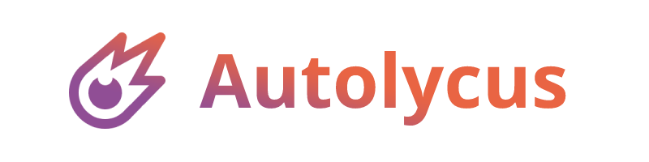
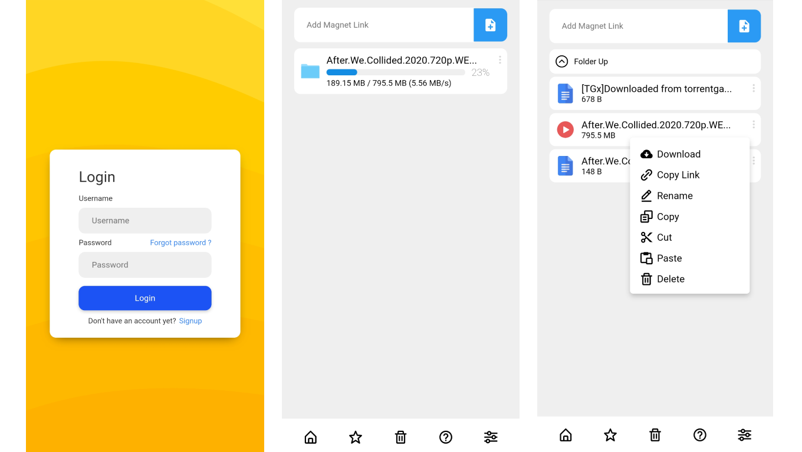
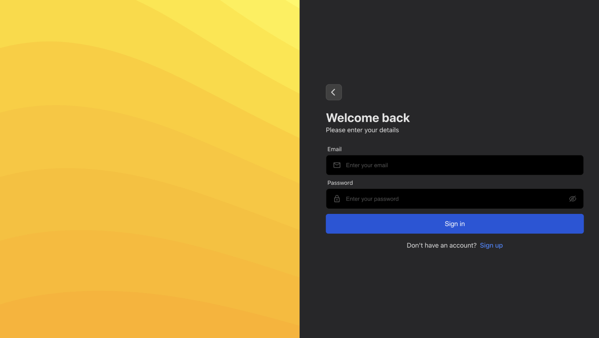
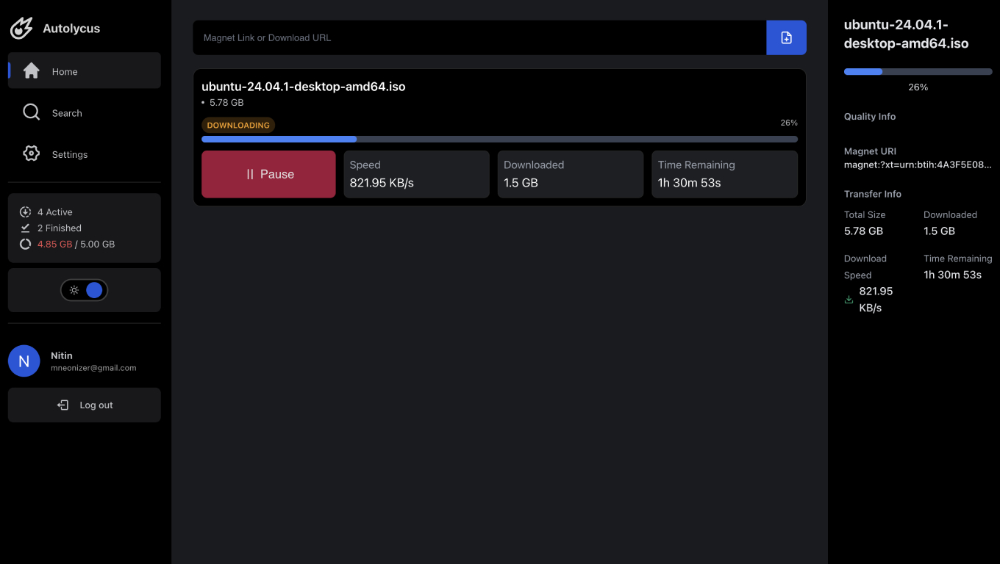

[![Contributors][contributors-shield]][contributors-url]
[![Forks][forks-shield]][forks-url]
[![Stargazers][stars-shield]][stars-url]
[![Issues][issues-shield]][issues-url]
[![LinkedIn][linkedin-shield]][linkedin-url]


<br />

<p align="center">
  <a href="https://github.com/algofly-oss/autolycus">
    
  </a>

  <h3 align="center">Home server companion</h3>

  <p align="center">
    stream torrent files from hosted web servers remotely!
    <br />
    <a href="https://github.com/algofly-oss/autolycus"><strong>Explore the docs »</strong></a>
    <br />
    <br />
    <a href="https://youtu.be/iPUBuC5M-bI">View Demo</a>
    ·
    <a href="https://github.com/algofly-oss/autolycus/issues">Report Bug</a>
    ·
    <a href="https://github.com/algofly-oss/autolycus/issues">Request Feature</a>
  </p>
</p>

<details open="open">
  <summary>Table of Contents</summary>
  <ol>
    <li>
      <a href="#about-the-project">About The Project</a>
      <ul>
        <li><a href="#built-with">Built With</a></li>
      </ul>
    </li>
    <li>
      <a href="#getting-started">Getting Started</a>
      <ul>
        <li><a href="#prerequisites">Prerequisites</a></li>
        <li><a href="#installation">Installation</a></li>
      </ul>
    </li>
    <li><a href="#usage">Usage</a></li>
    <li><a href="#roadmap">Roadmap</a></li>
    <li><a href="#contributing">Contributing</a></li>
    <li><a href="#license">License</a></li>
    <li><a href="#contact">Contact</a></li>
    <li><a href="#acknowledgements">Acknowledgements</a></li>
  </ol>
</details>
<!-- ABOUT THE PROJECT -->

## About The Project
**Note:**

- This project started as a personal project to learn about react and docker. This was my first time working with react so the code might not be the best, I have certainly learned a lot from this project and maintaining or updating it is just too much work for me, so I have decided to open source it.

- I have been using [qBittorrent](https://www.qbittorrent.org/) for a long time now, but I always felt that it was missing something, I wanted to be able to stream the content from my server remotely, so I decided to build this application.

- Currently this project sends a get request at fixed intervals to get the updates, that's not the best way to do it, I will be using web sockets to get real time updates.

- The libtorrent module in this repository is now updated to use more connection threads, so that the download speed is increased (Make sure to use full magnet uri which also includes the trackers).




There are lot of times when you want to access the specific content of a torrent file but don't want to waste bandwidth on downloading the entire file, this can be solved by downloading the file on a remote server and then browsing through the files.

* With remote file browsing / download support
* Optimized for both web and mobile views, responsive layout
* Built using Next.js and Fast API ⚡

A mobile first UI design so that you can enjoy the content seamlessly, Inspired by trending designs on [Dribble](https://dribbble.com/).

List of commonly used resources that I find helpful are listed in the acknowledgements.

### Built With

The application is containarized so that you don't need to go through the hassle of installing dependencies, tech stack used to built this application is listed below.
* [Fast API](https://fastapi.tiangolo.com/)
* [Libtorrent](https://libtorrent.org/)
* [Next.js](https://nextjs.org/)
* [Mongodb](https://www.mongodb.com/)
* [Docker](https://www.docker.com/)


<!-- GETTING STARTED -->

## Getting Started

This project is focused to run on server environment hence docker containers are used to deploy the application.

### Prerequisites

- [Ubuntu18.04+](https://ubuntu.com/tutorials/install-ubuntu-desktop#1-overview)

- [Docker](https://docs.docker.com/engine/install/ubuntu/)

### Installation

2. Clone the repo
   ```sh
   git clone https://github.com/algofly-oss/autolycus.git
   ```
3. Create `.env` file inside the project root folder, add the following to it (refer `env.example`)
   ```sh
   cp env.example .env
   ```
4. Run the containers
   ```sh
   sudo docker compose up
   ```


<!-- USAGE EXAMPLES -->
## Usage

- When you run the application for the very first time It will ask you to login, you can signup for a new account and login with the credentials.

  

- Once logged in you can paste any valid torrent magnet link into the `Add Magnet` input field and it will start downloading the torrent file.

  


<!-- ROADMAP -->

## Roadmap

See the [open issues](https://github.com/algofly-oss/autolycus/issues) for a list of proposed features (and known issues).


<!-- CONTRIBUTING -->
## Contributing

Contributions are what make the open source community such an amazing place to be learn, inspire, and create. Any contributions you make are **greatly appreciated**.

1. Fork the Project
2. Create your Feature Branch (`git checkout -b feature/AmazingFeature`)
3. Commit your Changes (`git commit -m 'Add some AmazingFeature'`)
4. Push to the Branch (`git push origin feature/AmazingFeature`)
5. Open a Pull Request


<!-- LICENSE -->
## License

Distributed under the GNU General Public License v3.0. See [LICENSE](LICENSE.txt) for more information.


<!-- CONTACT -->
## Contact

Nitin Rai - [@imneonizer](https://www.linkedin.com/in/imneonizer/) - mneonizer@gmail.com

Project Link: [https://github.com/algofly-oss/autolycus](https://github.com/algofly-oss/autolycus)


<!-- MARKDOWN LINKS & IMAGES -->
<!-- https://www.markdownguide.org/basic-syntax/#reference-style-links -->

[contributors-shield]: https://img.shields.io/github/contributors/algofly-oss/autolycus.svg?style=for-the-badge
[contributors-url]: https://github.com/algofly-oss/autolycus/graphs/contributors
[forks-shield]: https://img.shields.io/github/forks/algofly-oss/autolycus.svg?style=for-the-badge
[forks-url]: https://github.com/algofly-oss/autolycus/network/members
[stars-shield]: https://img.shields.io/github/stars/algofly-oss/autolycus.svg?style=for-the-badge
[stars-url]: https://github.com/algofly-oss/autolycus/stargazers
[issues-shield]: https://img.shields.io/github/issues/algofly-oss/autolycus.svg?style=for-the-badge
[issues-url]: https://github.com/algofly-oss/autolycus/issues
[license-shield]: https://img.shields.io/github/license/algofly-oss/autolycus.svg?style=for-the-badge
[license-url]: https://github.com/algofly-oss/autolycus/blob/main/LICENSE.txt
[linkedin-shield]: https://img.shields.io/badge/-LinkedIn-black.svg?style=for-the-badge&logo=linkedin&colorB=555
[linkedin-url]: https://www.linkedin.com/in/imneonizer/
